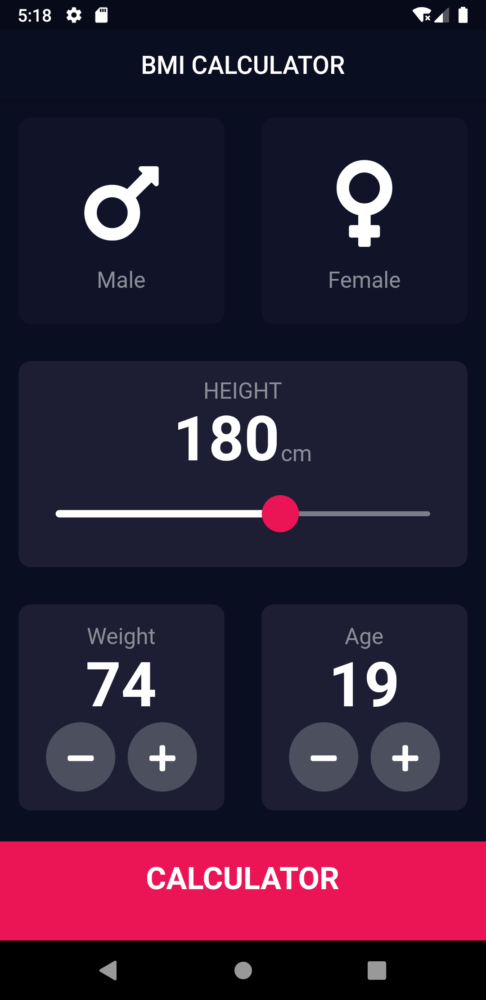
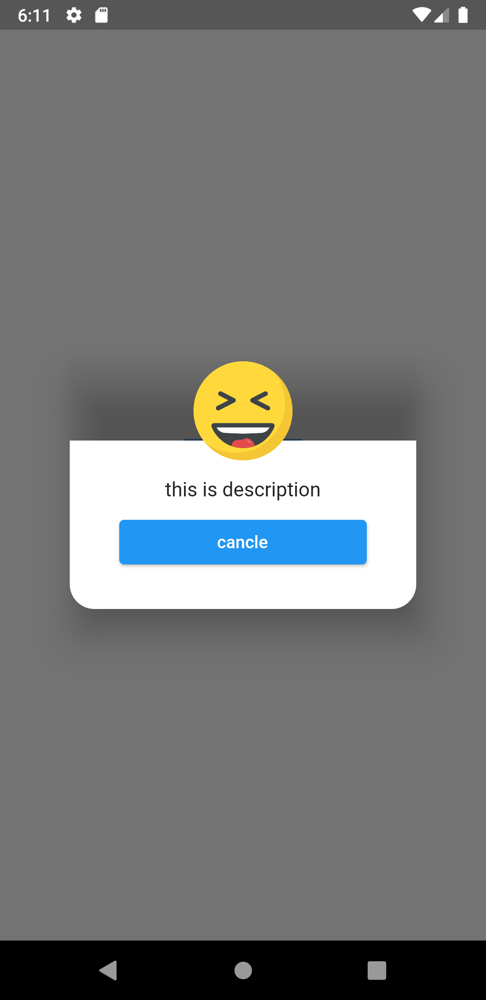

# flutterexamples
Flutter many examples 

# BMI CALULATOR
  &nbsp; 

 # DICEE
 

 # EMOJI ALERT BOX
 &nbsp; 

# FOODERLICH

# LIGHT SWITCH
 &nbsp; 

# LOGIN UI
 &nbsp; 

# MI CARD

# Nenumorphism Buttom

# QUIZZLER

# RATING APP

# Skyfky
 &nbsp; 

